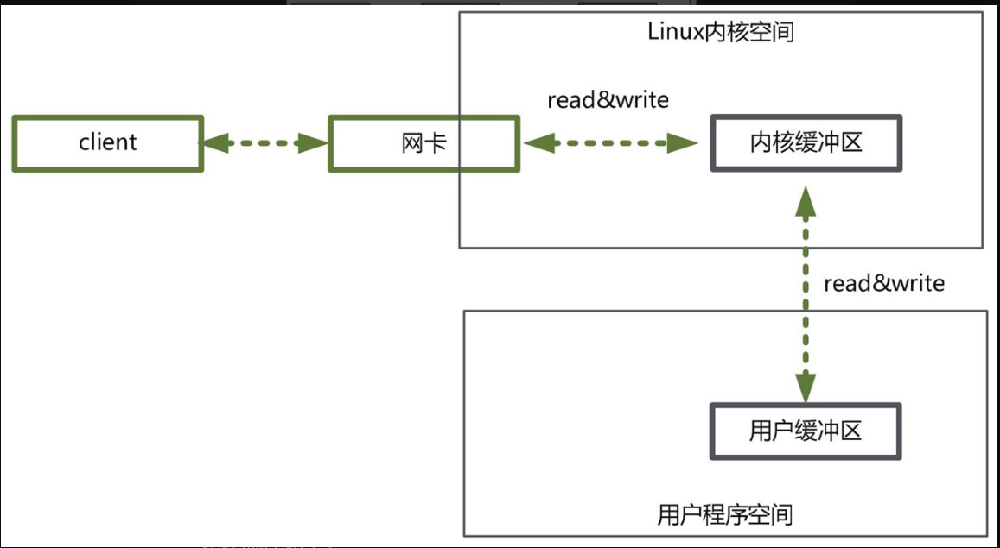

&emsp;&emsp;大家知道，用户程序进行IO的读写，依赖于底层的IO读写，基本上会用到底层的read&write两大系统调用。在不同的操作系统中，IO读写的系统调用的名称可能不完全一样，但是基本功能是一样的。  
&emsp;&emsp;这里涉及一个基础的知识：read系统调用，并不是直接从物理设备把数据读取到内存中；write系统调用，也不是直接把数据写入到物理设备。上层应用无论是调用操作系统的read，还是调用操作系统的write，都会涉及缓冲区。具体来说，调用操作系统的read，是把数据从内核缓冲区复制到进程缓冲区；而write系统调用，是把数据从进程缓冲区复制到内核缓冲区。  
&emsp;&emsp;也就是说，上层程序的IO操作，实际上不是物理设备级别的读写，而是缓存的复制。read&write两大系统调用，都不负责数据在内核缓冲区和物理设备（如磁盘）之间的交换，这项底层的读写交换，是由操作系统内核（Kernel）来完成的。注：本书后文如果没有特别指明，内核即指操作系统内核。  
&emsp;&emsp;在用户程序中，无论是Socket的IO、还是文件IO操作，都属于上层应用的开发，它们的输入（Input）和输出（Output）的处理，在编程的流程上，都是一致的。
### 内核缓冲区与进程缓冲区  
&emsp;&emsp;为什么设置那么多的缓冲区，为什么要那么麻烦呢？缓冲区的目的，是为了减少频繁地与设备之间的物理交换。大家都知道，外部设备的直接读写，涉及操作系统的中断。发生系统中断时，需要保存之前的进程数据和状态等信息，而结束中断之后，还需要恢复之前的进程数据和状态等信息。为了减少这种底层系统的时间损耗、性能损耗，于是出现了内存缓冲区。  
&emsp;&emsp;有了内存缓冲区，上层应用使用read系统调用时，仅仅把数据从内核缓冲区复制到上层应用的缓冲区（进程缓冲区）；上层应用使用write系统调用时，仅仅把数据从进程缓冲区复制到内核缓冲区中。底层操作会对内核缓冲区进行监控，等待缓冲区达到一定数量的时候，再进行IO设备的中断处理，集中执行物理设备的实际IO操作，这种机制提升了系统的性能。至于什么时候中断（读中断、写中断），由操作系统的内核来决定，用户程序则不需要关心。  
&emsp;&emsp;从数量上来说，在Linux系统中，操作系统内核只有一个内核缓冲区。而每个用户程序（进程），有自己独立的缓冲区，叫作进程缓冲区。所以，用户程序的IO读写程序，在大多数情况下，并没有进行实际的IO操作，而是在进程缓冲区和内核缓冲区之间直接进行数据的交换。
### 详解典型的系统调用流程
&emsp;&emsp;前面讲到，用户程序所使用的系统调用read&write，它们不等价于数据在内核缓冲区和磁盘之间的交换。read把数据从内核缓冲区复制到进程缓冲区，write把数据从进程缓冲区复制到内核缓冲区，具体的流程，如下图所示。  

  
这里以read系统调用为例，先看下一个完整输入流程的两个阶段：
- 等待数据准备好。
- 从内核向进程复制数据。
  
  
如果是read一个socket（套接字），那么以上两个阶段的具体处理流程如下
- 第一个阶段，等待数据从网络中到达网卡。当所等待的分组到达时，它被复制到内核中的某个缓冲区。这个工作由操作系统自动完成，用户程序无感知。 
- 第二个阶段，就是把数据从内核缓冲区复制到应用进程缓冲区。
  
  
再具体一点，如果是在Java服务器端，完成一次socket请求和响应，完整的流程如下：
- 客户端请求：Linux通过网卡读取客户端的请求数据，将数据读取到内核缓冲区。
- 获取请求数据：Java服务器通过read系统调用，从Linux内核缓冲区读取数据，再送入Java进程缓冲区。
- 服务器端业务处理：Java服务器在自己的用户空间中处理客户端的请求。
- 服务器端返回数据：Java服务器完成处理后，构建好的响应数据，将这些数据从用户缓冲区写入内核缓冲区。这里用到的是write系统调用。
- 服务器端返回数据：Java服务器完成处理后，构建好的响应数据，将这些数据从用户缓冲区写入内核缓冲区。这里用到的是write系统调用。