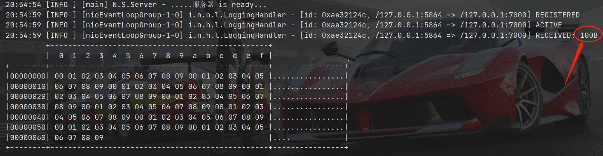
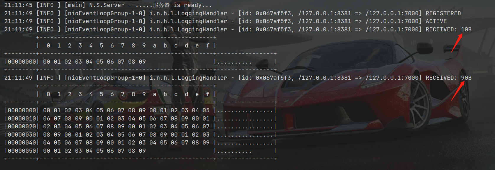

### 粘包

client连续发送10次长度为10的byte数组

```java class
ByteBuf buffer = ctx.alloc().buffer();
for (int i = 0; i < 10; i++) {
    buffer.writeBytes(new byte[]{0,1,2,3,4,5,6,7,8,9});
}
ctx.writeAndFlush(buffer);
```

server收到的消息如下，可以看到，server一次性收到了长度为100字节的数据。这就是粘包现象，client发送了10次，而server只接收了1次 




### 半包（拆包）

client发送一个长度为100的byte数组

在server端，将server的接收缓冲区设置小一点  
如下图所示，server端分两次收到了全部数据，这就是半包现象



### 产生原因
TCP是面向字节流的协议，没有消息边界，操作系统在发送TCP数据时，会通过缓冲区进行优化  
如果一次请求发送的数据量比较小，没达到缓冲区大小，TCP会将多个请求合并为同一个请求进行发送，这就形成了粘包问题   
如果一次请求发送的数据量比较大，超过了缓冲区大小，TCP会将其拆分成多次发送，这就是拆包

### 解决方法

#### 短连接 （不推荐）
每次发送完一条消息就断开连接，要发送消息时重新建立连接
短连接能够解决粘包问题，但不能解决拆包问题

#### 定长解码器
发送方把每个包都封装成固定的长度，比如100字节。如果不足100字节可通过补0或者其他信息，填充到指定长度

#### 消息头带消息长度
将消息分为消息头和消息体，消息头中保存整个消息的长度，根据长度去读取消息体。

